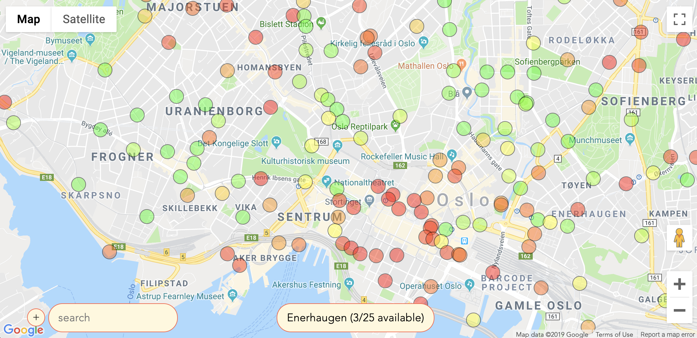

# vuehu


Your typical bikesharing app

Decorated vue combined with rxjs state

On top of google maps with custom svg markers

Built with ❤️ from webpack, typescript, babel and eslint


### Let's go

Get your gmaps api key and do as below
```bash
touch .env
echo "GMAPS_API_KEY" >> .env
```

```bash
npm run install|serve|ts|lint|build
```



### todos

* The custom svg markers might cause lag
* Typing for vue files is not working properly
* 🧼🧹